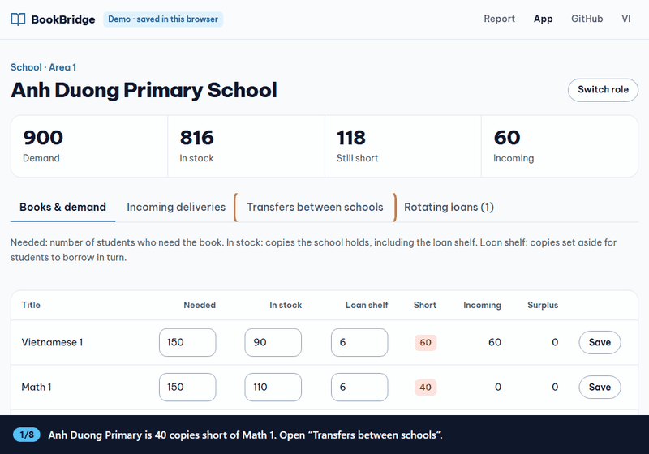
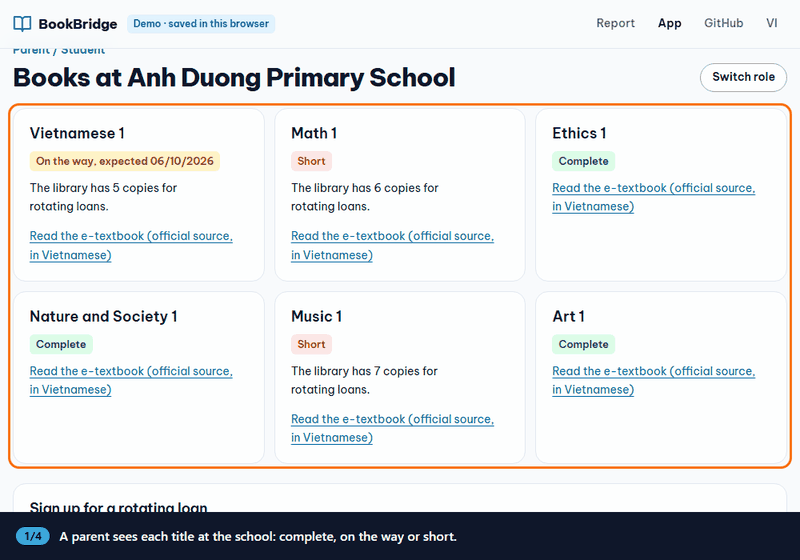
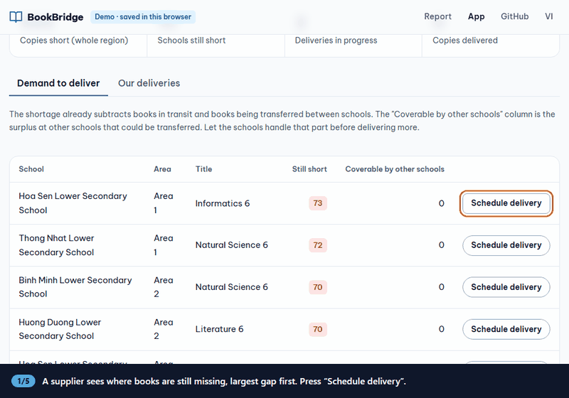

# BookBridge

A bridging solution that keeps students learning when textbooks have not all arrived: reorganise how books are used in the classroom, and use a small web app to move legally printed copies to the schools that are short. No photocopying, and no extra cost for parents.

- **Live site:** https://ngth1010v.github.io/Book-bridge/
- **Report:** [English](https://ngth1010v.github.io/Book-bridge/index.en.html) · [Tiếng Việt](https://ngth1010v.github.io/Book-bridge/index.html)
- **Demo app:** [English](https://ngth1010v.github.io/Book-bridge/app.html?lang=en) · [Tiếng Việt](https://ngth1010v.github.io/Book-bridge/app.html?lang=vi)

The site is available in English and Vietnamese; switch with the `EN` / `VI` link in the header. The data in the app is sample data: school and supplier names are fictional.

## How the app is used

### A school that is short asks another school for spare books

Anh Duong Primary is short of Math 1 and Sao Mai Primary has spare copies. The two schools agree in the app and both stock counts update.



### A parent checks the books and signs up for a loan

A parent sees which titles are complete, on the way or short, then signs up to borrow a copy in turn.



### A supplier schedules a delivery

A supplier sees where books are still missing, creates a delivery and updates its status.



## Run it locally

You only need Python 3. There is nothing to install.

### Static site (same as GitHub Pages)

Data is kept in the browser's `localStorage`, seeded from `seed.json`.

```bash
run.bat                      # Windows, opens the browser for you
python -m http.server 8000   # any other system
```

Open http://localhost:8000.

### With the backend

Data is kept in SQLite (`data.db`), so several machines can share it.

```bash
run.bat backend-enable       # Windows, opens the browser for you
python server.py             # any other system
```

Open http://localhost:8000. The app detects the backend and switches to the API on its own.

- Reload the sample data: delete `data.db`.
- Let other machines connect: set `BOOKBRIDGE_HOST=0.0.0.0`. The backend has no sign-in yet, so use it on a trusted network only.

## Tests

```bash
node logic.test.js      # shortage, surplus and transfer-suggestion logic
node i18n.test.js       # every app string has an English translation
python test_server.py   # API
```

## Files

| File | What it is |
| --- | --- |
| `index.html`, `index.en.html` | The report, in Vietnamese and English |
| `app.html`, `app.js` | The app for schools, parents and suppliers |
| `i18n.js` | English text for the app |
| `logic.js` | Pure functions: shortage, surplus, incoming, transfer suggestions |
| `styles.css` | Shared styles |
| `seed.json` | Sample data |
| `server.py` | Optional backend (Python standard library + SQLite) |

## Credits

- Code: see [`LICENSE`](LICENSE).
- Photo `classroom.jpg`: [“Classroom in Vietnam”](https://commons.wikimedia.org/wiki/File:Classroom_in_Vietnam_(cropped).jpg) by Phat14082005, licensed [CC BY-SA 4.0](https://creativecommons.org/licenses/by-sa/4.0/), resized.
- The repository contains no textbook content. E-textbooks are only linked at their official source.
