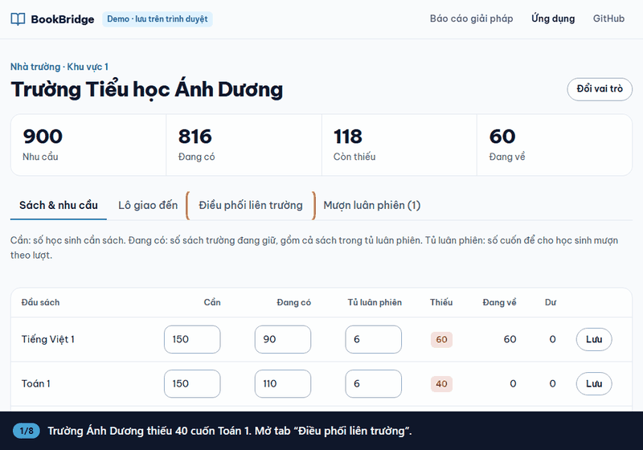
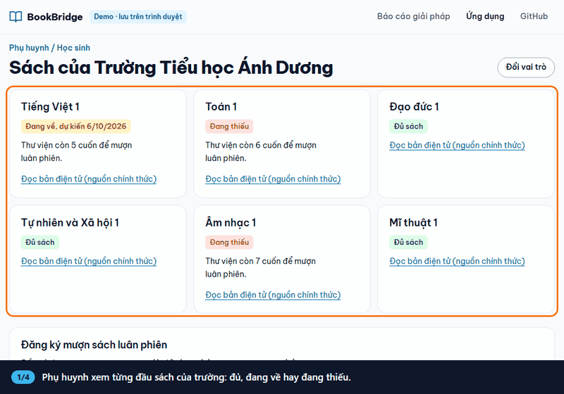
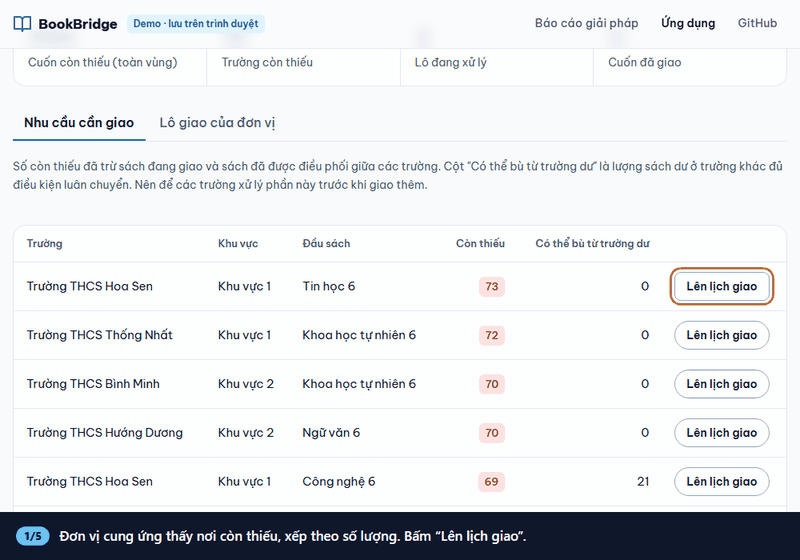

# BookBridge

Giải pháp chuyển tiếp giúp học sinh không bị gián đoạn việc học khi sách giáo khoa chưa về đủ: tổ chức lại cách dùng sách tại lớp, và một ứng dụng web điều phối các bản sách in hợp pháp đến đúng nơi đang thiếu. Không photocopy, phụ huynh không tốn thêm chi phí.

- **Xem trực tuyến:** https://ngth1010v.github.io/Supplying-textbook-solution/
- **Báo cáo giải pháp:** [`index.html`](https://ngth1010v.github.io/Supplying-textbook-solution/index.html)
- **Ứng dụng demo:** [`app.html`](https://ngth1010v.github.io/Supplying-textbook-solution/app.html)

Dữ liệu trong ứng dụng là dữ liệu mẫu: tên trường và đơn vị là giả định.

## Ứng dụng dùng thế nào

### Trường thiếu xin sách dư của trường khác

Trường Ánh Dương thiếu Toán 1, Trường Sao Mai đang dư. Hai trường thỏa thuận ngay trên ứng dụng, số sách tự cập nhật.



### Phụ huynh xem sách và đăng ký mượn

Phụ huynh xem đầu sách nào đã đủ, đang về hay đang thiếu, rồi đăng ký mượn luân phiên.



### Đơn vị cung ứng lên lịch giao

Đơn vị cung ứng thấy nơi còn thiếu, tạo lô giao và cập nhật trạng thái.



## Chạy trên máy

Chỉ cần Python 3, không cần cài thư viện.

### Web tĩnh (giống GitHub Pages)

Dữ liệu lưu trong `localStorage` của trình duyệt, khởi tạo từ `seed.json`.

```bash
run.bat                      # Windows, tự mở trình duyệt
python -m http.server 8000   # hệ điều hành khác
```

Mở http://localhost:8000.

### Web có backend

Dữ liệu lưu trong SQLite (`data.db`), nhiều máy dùng chung được.

```bash
run.bat backend-enable       # Windows, tự mở trình duyệt
python server.py             # hệ điều hành khác
```

Mở http://localhost:8000. Ứng dụng tự nhận ra backend và chuyển sang dùng API.

- Nạp lại dữ liệu mẫu: xóa `data.db`.
- Cho máy khác truy cập: đặt `BOOKBRIDGE_HOST=0.0.0.0`. Backend chưa có đăng nhập, chỉ dùng trong mạng tin cậy.

## Kiểm tra

```bash
node logic.test.js      # logic tính thiếu, dư và gợi ý điều phối
python test_server.py   # API
```

## Cấu trúc

| Tệp | Nội dung |
| --- | --- |
| `index.html` | Báo cáo giải pháp |
| `app.html`, `app.js` | Ứng dụng cho nhà trường, phụ huynh, đơn vị cung ứng |
| `logic.js` | Hàm thuần: thiếu, dư, đang về, gợi ý điều phối |
| `styles.css` | Giao diện dùng chung |
| `seed.json` | Dữ liệu mẫu |
| `server.py` | Backend tùy chọn (Python stdlib + SQLite) |

## Ghi công

- Mã nguồn: giấy phép trong [`LICENSE`](LICENSE).
- Ảnh `classroom.jpg`: [“Classroom in Vietnam”](https://commons.wikimedia.org/wiki/File:Classroom_in_Vietnam_(cropped).jpg) của Phat14082005, giấy phép [CC BY-SA 4.0](https://creativecommons.org/licenses/by-sa/4.0/deed.vi), đã thu nhỏ.
- Repo không chứa nội dung sách giáo khoa. Sách điện tử chỉ được dẫn liên kết đến nguồn chính thức.
